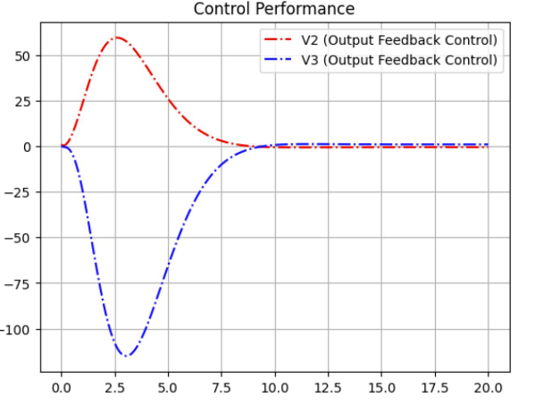
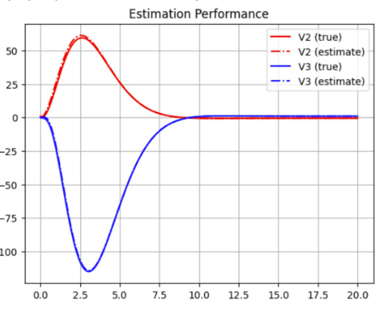

# Amplfiier Circuit
In this task, we create an output feedback controller which involves combining a controller of the form K = -Kx and an observer that minimizes our error relative to our output. 

## Circuit Topology

### System Equations

## Performance with Output Feedback Controller

## Observer Estimation Compared to Output

