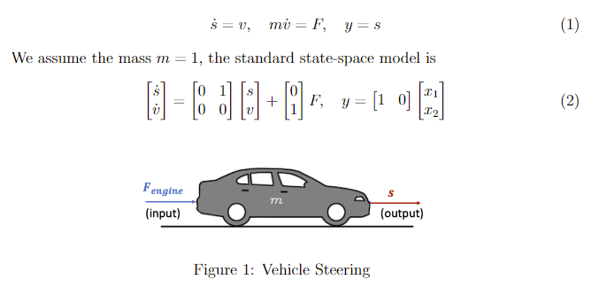
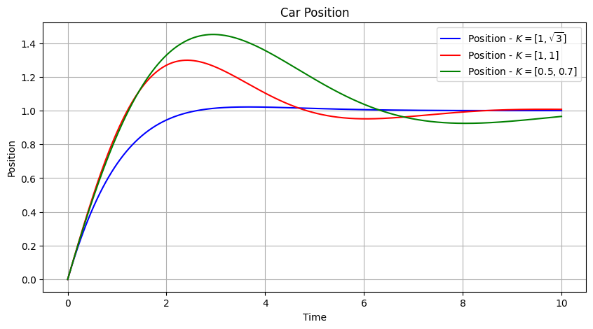
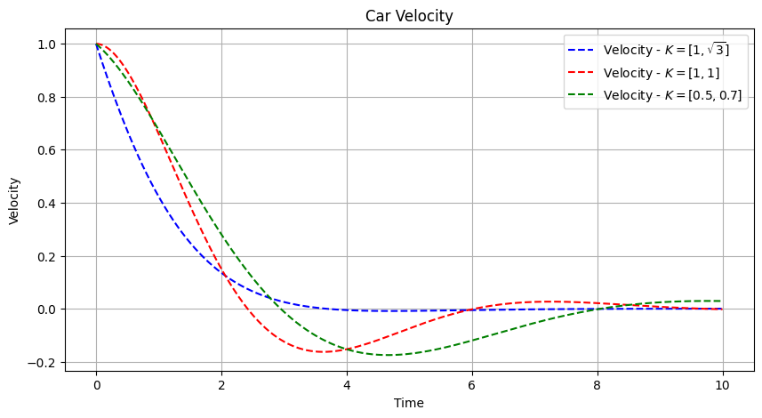
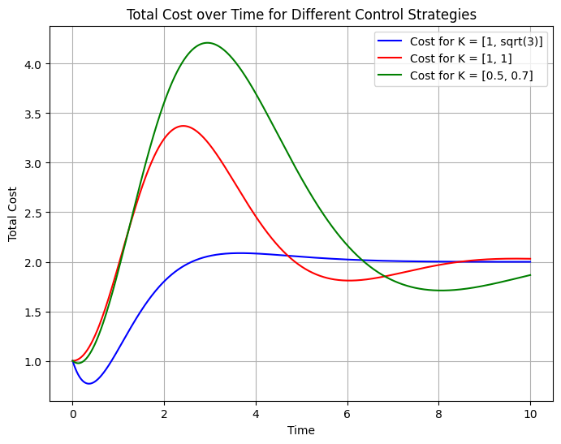
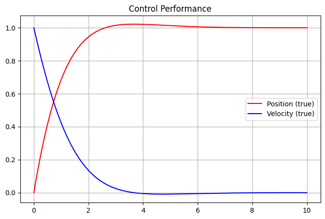
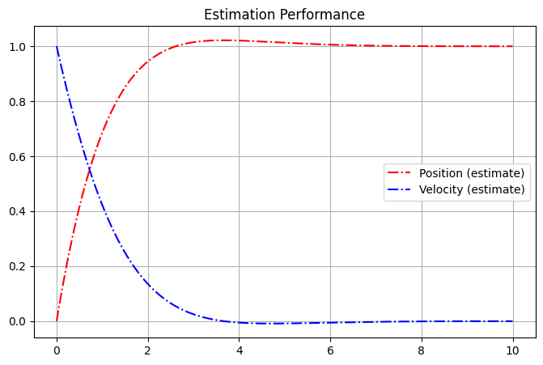

# Car Vehicle Control
In this assignment, we implement a car's vehicle control by implementing an LQR and a Kalman Filter.

## Model of Car Vehicle Control

## Controller Design
### Car Position

### Car Velocity

### Cost of Different Controllers

## Observer Design
### True Output Values

### Observer Estimation Values
