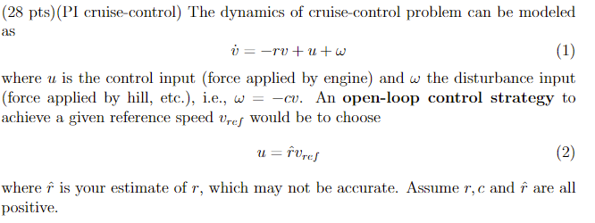
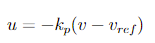
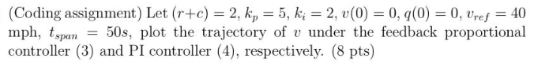
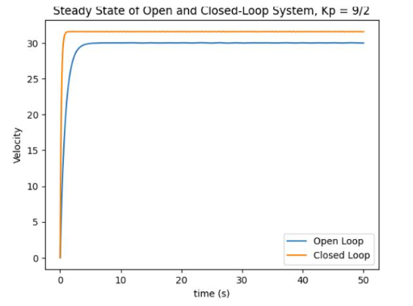
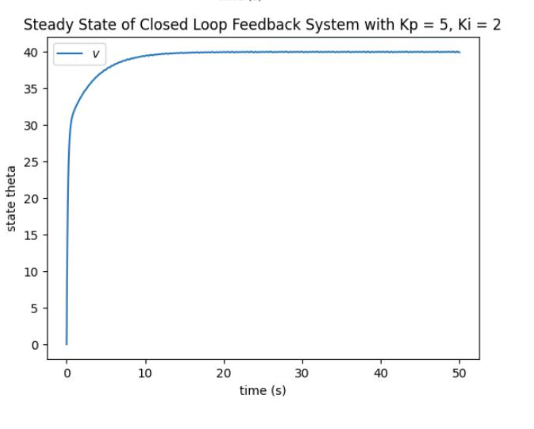

# Cruise Control
In this task, we analyze how we can create a cruise control system.

## Cruise Control Variables
### Cruise Control Equation

### Closed Feedback Strategy

## PI Controller Implementation

### Initial Conditions of System

### Trajectory with Kp = 4.5

### Trajectory with Kp = 4.5, Ki = 2
