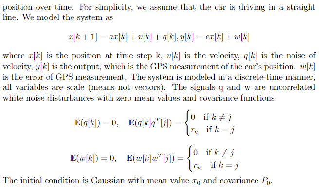
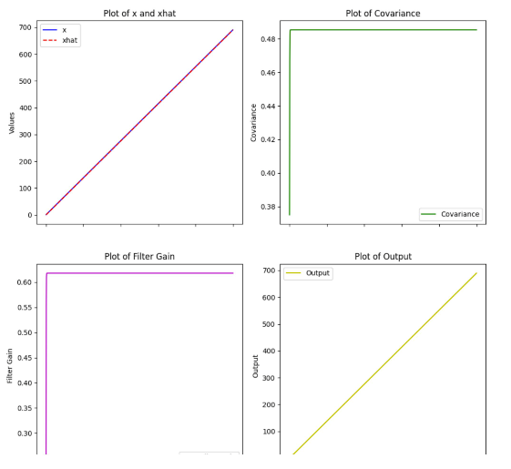

# GPS System
We use a 1st order system and assume a trivial system where the car is moving in a straight line.

## Model of Simplified GPS System

## Implementation of Kalman Filter

#### Note: As the system is very trivial and our covariance converges very fast, we expect a unit function.