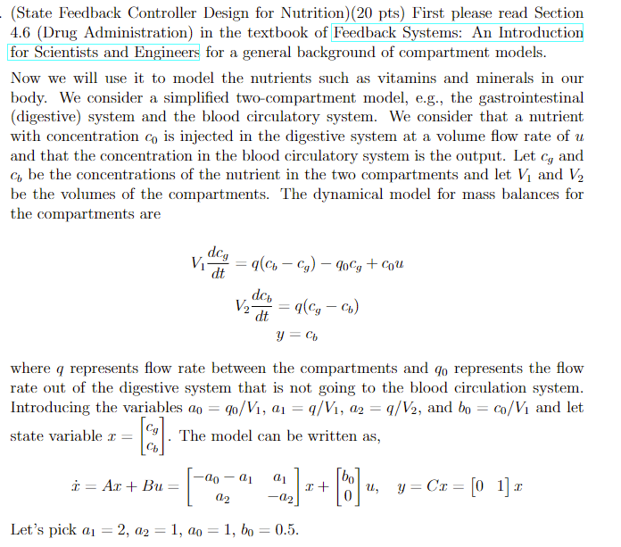
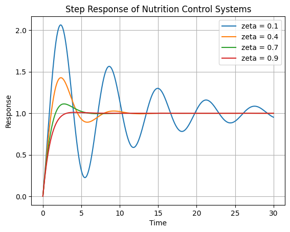

# Nutrient System
In this task, we create a state feedback controller to regulate our gastrointestinal and circulatory system. A bulk of the work involves analytically deriving the solutions to this system. The graph is only possible as a result of derivation. If needed, please email kevshin2002@gmail.com.

## Model of Simplified Nutrient System

## Controller Design
Due to academic integrity, analytical work can not be shown here which illustrates mathematical constraints on specific variables.

## Step Response with Controller for Nutrient System with different Zetas

