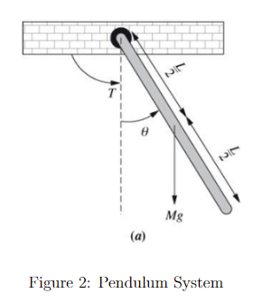
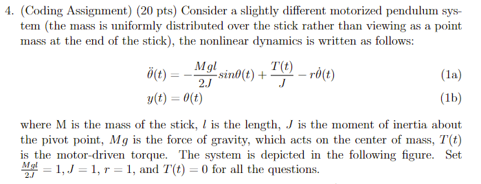
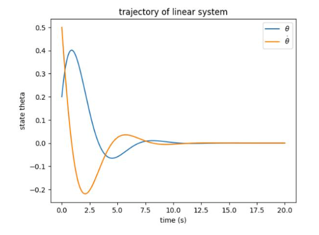
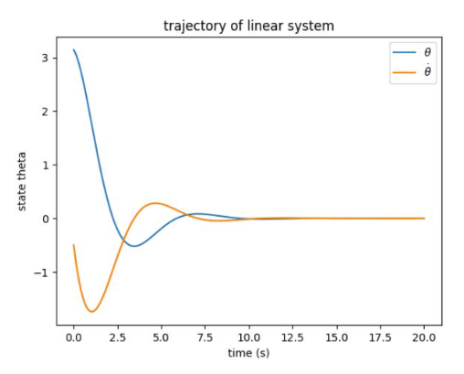
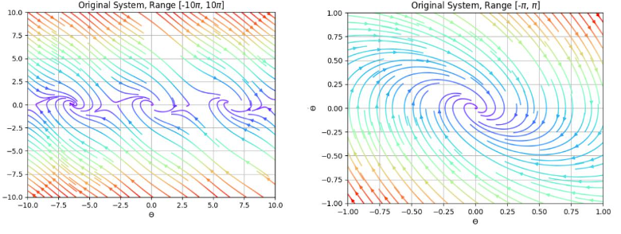
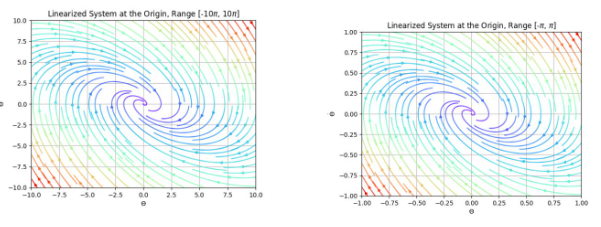
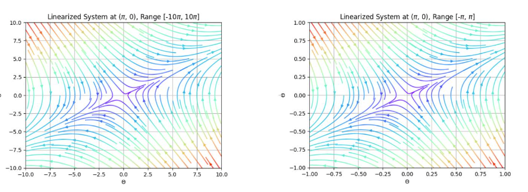

# Pendulum System
In this task, we analyze a nonlinear pendulum system and see if we can make it better by adding a controller.

## Model of the Pendulum System

### System Equation of the Model
In this system, the state variables are:
- x1(t) = angle
- x2(t) = change in angle

Without any controller, we analyze the stability:

#### Stability of Pendulum System at x = (0.2, 0.5)

#### Stability of Pendulum System at x = (pi, -0.5)

#### Stability and Linearization around Equilibrium Points
##### Phase Portrait of Original Pendulum System

##### Phase Portrait Linearized at the Origin

##### Phase Portrait Linearized at (pi, 0)

### Designing a Controller
The conditions to design a controller for this system is met, as can be found via computing the reachability matrix. 

We design a controller of the form u = -Kx. We can find the conditions for K but for sake of academic integrity, I am not listing them down below.

As such, we try a K that fits the mathematical constraints: K = [1.2, 1]

#### Trajectory of Non-Linearized System with Controller
![Pendulum with Controller, K = [1.2, 1]](./imgs/pend_controller_c.png)

##### Note: It should converge to pi, but due to a coding mistake, converges to 0. (Should be x - x_error).