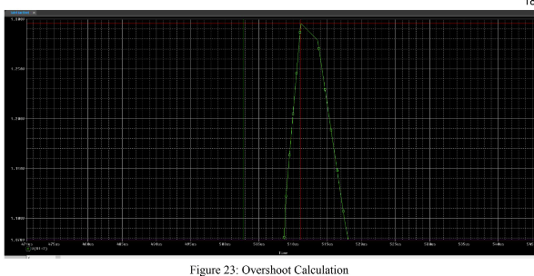

# Differentiator Circuit
In this circuit, we try to create a differentiator circuit. We also add a compensator to improve our phase margin which we do by adding either a resistor in series or a capacitor in parallel. We show that these two essentially do the same.

## Differentiator Circuit Topology

### Frequency Response of Differentiator

### Step Response of Differentiator

### MATLAB Data Specification of Differentiator

### Overshoot of Differentiator

### Risetime of Differentiator

### Real Simulation of Differentiator

## Differentiator Circuit with Compensation Resistor Topology

### Frequency Response of Differentiator with Compensation Resistor

### Step Response of Differentiator with Compensation Resistor

### MATLAB Data Specification of Differentiator with Compensation Resistor

### Overshoot of Differentiator with Compensation Resistor

### Risetime of Differentiator with Compensation Resistor

### Real Simulation of Differentiator with Compensation Resistor

### Frequency Response of Differentiator with Optimized Compensation Resistor

### Step Response of Differentiator with Optimized Compensation Resistor

### MATLAB Data Specification of Differentiator with Optimized Compensation Resistor

### Overshoot of Differentiator with Optimized Compensation Resistor

### Risetime of Differentiator with Optimized Compensation Resistor

### Real Simulation of Differentiator with Optimized Compensation Resistor

## Differentiator Circuit with Parallel Capacitor Topology

### Overshoot of Differentiator with Parallel Capacitor

### Risetime of Differentiator with Parallel Capacitor

### Real Simulation of Differentiator with Parallel Capacitor

## Conclusion
We see that op-amps have characteristics that are both ideal and non ideal. The non-ideal characteristics interfere with our circuits that we are designing and cause ringing as a result of an extra pole. This illustrates the marginal stability of the circuit and how the gain and phase margins are related to the stability. By adding a compensation resistor, we can design our circuit to meet our design specifications by trading off overshoot for risetime.