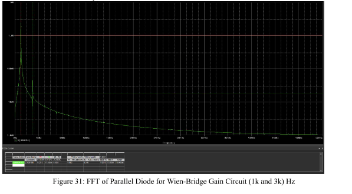
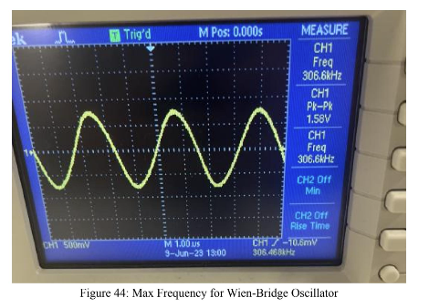

# Wien Bridge Oscillator and Nyquist Plot
In this lab, we utilize nyquist plot to realize the stability of our previous lab circuits. We also use the Nyquist plot on the Wien Bridge while seeing that diodes in different regions give the same output.

### Bode and Phase Plot of Differentiator

### Nyquist Plot of Loop Gain of Differentiator

### Bode and Phase Plot of Differentiator with Compensation Resistor

### Nyquist and Phase Plot of Differentiator with Compensation Resistor

### Bode and Phase Plot of Voltage Follower Circuit

### Nyquist Plot of Loop Gain of Voltage Follower Circuit

### Bode and Phase Plot of Voltage Follower Circuit with Capacitative Load

### Nyquist Plot of Loop Gain of Voltage Follower Circuit with Capacitative Load

### Bode and Phase Plot of Voltage Follower Circuit with Optimized Capcitative Load

### Nyquist Plot of Loop Gain of Voltage Follower Circuit with Optimized Capacitative Load

### Topology of Wien Bridge Circuitry

### Simulation Model of Wien Bridge Oscillator

### Nyquist Plot of Wien Bridge Oscillator

### Simulation of Wien Bridge Oscillator using Simulink

### Simulation of Wien Bridge Oscillator

### Fast Fourier Transform of Wien Bridge Oscillator

### Minimum Frequency of Wien Bridge Oscillator

### Maximum Frequency of Wien Bridge Oscillator

### Soft Clipping of Wien Bridge Oscillator

### Real Clipping of Wien Bridge Oscillator

### Output of Wien Bridge Oscillator

### Soft Clipping of Wien Bridge Oscillator at 301 kHz

### Topology of Wien Bridge Circuitry with Parallel Diodes

### Simulation of Wien Bridge Oscillator with Parallel Diodes

### Fast Fourier Transform of Wien Bridge Oscillator with Parallel Diodes

### Soft Clipping of Parallel Diodes at 6k Resistance

### Output of Wien Bridge Oscillator at 6k Resistance

### Soft Clipping of Parallel Diodes at 15k Resistance

### Output of Wien Bridge Oscillator at 15k Resistance

### Maximum Frequency of Wien Bridge Oscillator at 15k Resistance

## Conclusion
We see how the Nyquist plot is a powerful tool in determining the stability as it allows us to look at the open-loop circuit and understand if the closed-loop system is stable. In addition, we understand how positive feedback is utilized such as in the Wien-Bridge Oscillator where we can take advantage of noise caused by resistors. By setting our gain to be greater than 3, we cause our system to become unstable, which allows our noise to be increased and formed into a sine wave due to the frequency being on the imaginary axis with no real part. 

We learned that these outputs are clipped but can be deferred by implementing strategies such as hard clipping or soft clipping with zener diodes, a result of their non-linaer IV models. In addition, we got a more in-depth understanding of the non-ideal characteristics of op-amps where it has a finite bandwidth as a result of a hard-set current source.