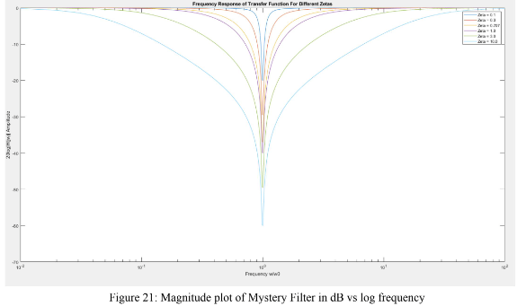

# RLC Circuit Analysis
The lab focused on four simple filters composed made up of only RLCs:
- Highpass
- Lowpass
- Bandpass
- Mystery (Bandstop)

## MATLAB Plots
### Highpass Filter
#### Circuit

#### Bode Plot (linear)

#### Bode Plot (Logarithmic)

#### Phase Plot

### Lowpass Filter
#### Circuit

#### Bode Plot (linear)

#### Bode Plot (Logarithmic)

#### Phase Plot

### Bandpass Filter
#### Circuit

#### Bode Plot (linear)

#### Bode Plot (Logarithmic)

#### Phase Plot

### Mystery Filter
#### Circuit

#### Bode Plot (linear)

#### Bode Plot (Logarithmic)

#### Phase Plot

### Influence of Zeta on Overshoot
Zeta values = [0.1, 0.3, 0.707, 1.0, 3.0, 10.0]

### Influence of Zeta on Step Response

## Conclusion
As displayed in the simulations, the mystery filter is the bandstop filter. This can be seen from the plots where only certain frequencies are attenuated and all other frequencies are not. All second-order RLC transfer functions shared the same denominator and the numerator changed depending on which element we were voltage dividing against. Depending on which element was on the numerator determined if it was a lowpass, highpass, bandpass, or a bandstop. The bandstop was done by having both the capacitor and inductor on the numerator. 

In terms of the zeta, it can be seen that the lower our zeta, the higher our overshoot, and the more oscillations we have. The higher the zeta, the more damping there will be and less oscillation. The critical value for the damping factor is 0.707 where the frequency response will cause a maximally flat transition. 