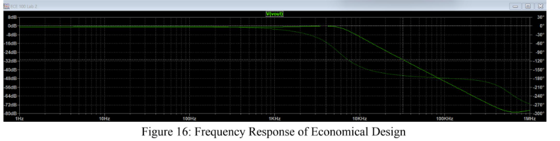

# Sallen Key Filter Analysis
This lab focused on the Sallen Key Filter which was implemented via butterworth filter. We found the margins around the gain and phase as well as the necessary shifting of frequency in order to stabilize our function and meet our design specifications.

The Design Specifications are shown in this image.

To achieve this design specification, we had to shift the natural frequency so that it attenuated accordingly to our design specs. This led to values for our capacitor and resistor for which our design worked.
## Sallen Key Circuit

## Peak Values of Butterworth Filter

## Frequency Response of Butterworth Filter

## Economical Design

## Economical Design Scaled

## Conclusion
This lab helped realize why Sallen Key is an important step in improving the efficiency of our filtering systems. Regarding economics, it rises above traditional RLC circuits by eliminating the larger, lossier inductors. Also, due to the transfer function and relationship between the natural frequency and component values, it is possible to scale the resistors a factor to make them cheaper to implement as long as the capacitors get scaled inversely. 

As for the results, the oscilloscope readings follow the trends of our simulation until the high frequency values where the attenuation seemingly caps. This is likely due to the inherent inductance of the proves not matching the specific needs of the experiment.