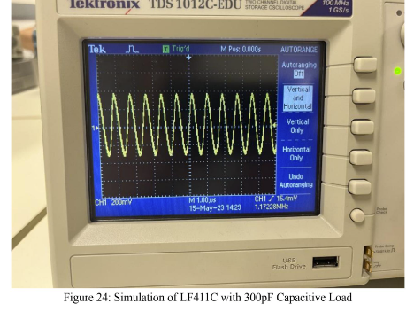

# Voltage Follower Circuit Analysis
In this lab, we focused on using an op-amp as a voltage follower and optimized it by adding a compensation resistor to minimize ringing.

## Voltage Follower Circuit Topology

## Correlation of DC gain with Bandwidth
We can trade off DC for bandwidth or vice versa depending on our design needs. 

## Adding a Capacitative Load to our Voltage Follwoer Circuit

## Adding a Compenstation Resistor

## Optimized Compensation Resistor

## Fastest Rise Time Simulation

## DC and Bandwidth in Real Life Settings
### 10 DB Bandwidth

### 30 DB Bandwidth

## Simulations of LF411C Capacitor with different values in Real Life Settings
### 100pF

### 300pF

### 1nF

### 2nF

### 4nF

### 10nF

## Simulation of LF411C with Optimized Values in Real Life Settings
This optimization was for an overshoot less than 11%.

## Rise Time in Real Life Settings

## Conclusion
We see that ideal op-amps have characteristics that are both ideal and non-ideal. By trading gain, we can gain more bandwidth and vice versa. We also saw that by adding a capacitor load, we get ringing, whic hwe can reduce by adding a compensation resistor. By having specific impedance dividers and circuit elements, we can manipulate our feedback ratio such that we transform our transfer function into a second order filter. This allows us to tailor it such that it meets our design specifications using metrics such as overshoot, rise time, and settling time.